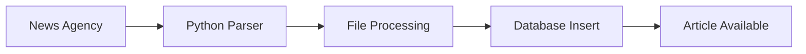
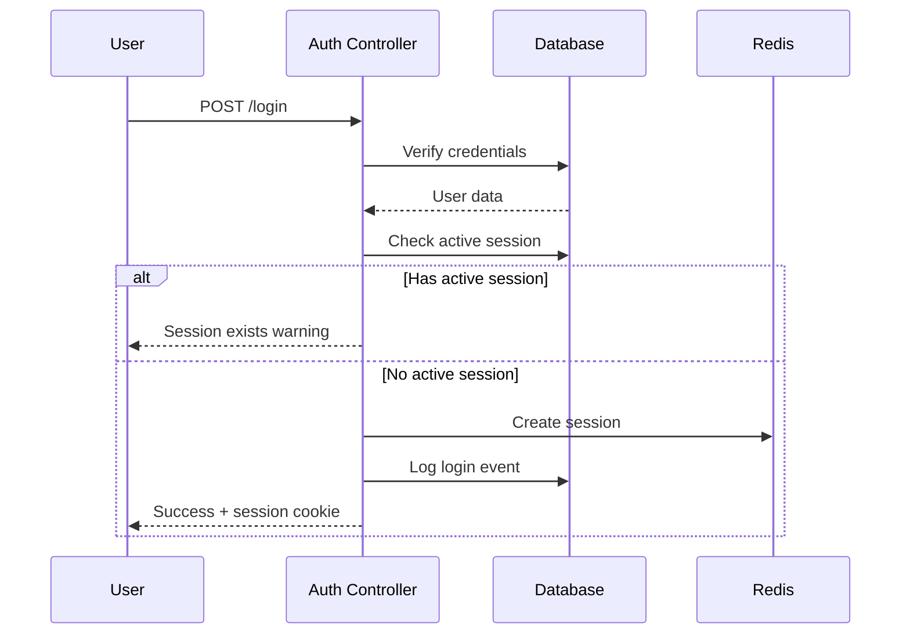
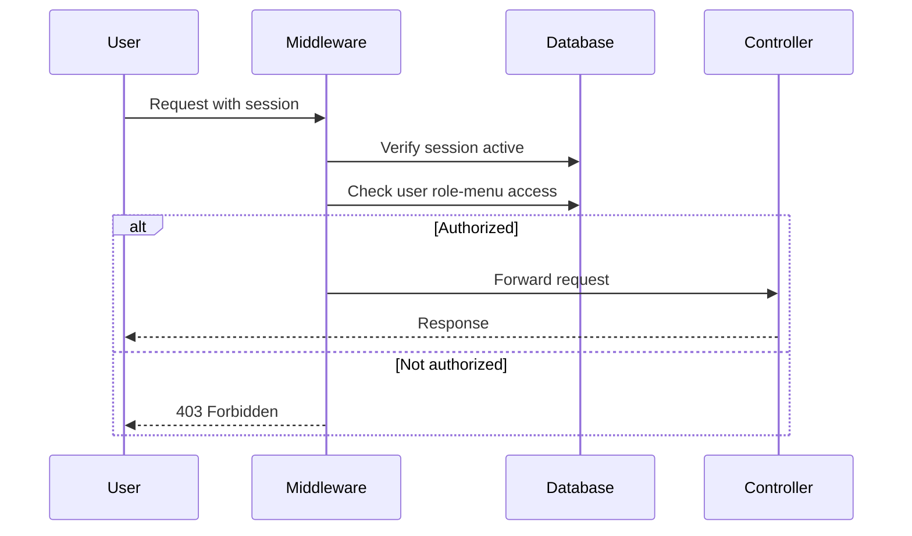

# Editorial Workflow & Article Lifecycle

This document describes the editorial workflow, user roles, and article lifecycle in the APS Dashboard system.

## Table of Contents

- [User Roles](#user-roles)
- [Service Organization](#service-organization)
- [Article Lifecycle](#article-lifecycle)
- [Access Control Flow](#access-control-flow)
- [Typical User Journeys](#typical-user-journeys)

## User Roles

The system implements a hierarchical role-based access control (RBAC) model:

### Role 1: Administrator (Super Admin)

**Capabilities:**
- Full system access to all modules
- User management (CRUD operations)
- Agency management (CRUD operations)
- Log and session monitoring
- System configuration
- Can create users with any role
- Can manage all services

**Menu Access:**
- Menu 2: Articles Access
- Menu 3: Agency Management
- Menu 4: Logs Access
- Menu 5: User Management

**Typical Tasks:**
- Create and manage user accounts
- Assign agencies to users
- Monitor system activity and security events
- Manage agency configurations
- Block/unblock users
- View system-wide statistics

### Role 2: Regular User (Content Viewer)

**Capabilities:**
- View articles from assigned agencies
- Search articles within assigned agencies
- Global search across all assigned agencies
- View personal dashboard statistics
- Update own profile
- Change own password

**Menu Access:**
- Menu 2: Articles Access

**Typical Tasks:**
- Browse articles from assigned news agencies
- Search for specific articles or topics
- View recent articles (last 20)
- Adjust article refresh rate
- Update language preference

### Role-Based Restrictions

```
Administrator (Role 1)
    │
    ├─── Can manage users in all services
    ├─── Can create any role (1 or 2)
    ├─── Can access all menu items
    └─── Can view system-wide logs

Regular User (Role 2)
    │
    ├─── Can only view assigned agencies
    ├─── Cannot manage other users
    ├─── Cannot create agencies
    └─── Limited to Menu 2 (Articles)
```

## Service Organization

Services organize users into logical groups with specific agency access patterns.

### Service Structure

```
online2024_service
    │
    ├─── Service 1: Internal Staff
    │       └─── Can access all active agencies
    │
    ├─── Service 2: Coopération
    │       └─── Restricted to APS agencies only (ID 1 & 2)
    │
    └─── Service N: Custom Department
            └─── Access defined by admin
```

### Coopération Service Special Rules

Users in the "Coopération" service have special restrictions:

```javascript
if (userService === "Coopération" && agencyId !== 1 && agencyId !== 2) {
    throw Error("Coopération users can only access APS agencies");
}
```

**Allowed Agencies for Coopération:**
- Agency ID 1: APS (Arabic)
- Agency ID 2: APS (French)

**Blocked Agencies:**
- All international agencies (AFP, ANSA, AZERTAC, MAP, MENA, etc.)

### Service-Role Relationship

```
Service → Role → Menu Access
   │        │         │
   │        │         ├─── Menu 2: Articles
   │        │         ├─── Menu 3: Agencies
   │        │         ├─── Menu 4: Logs
   │        │         └─── Menu 5: Users
   │        │
   │        └─── Determines base permissions
   │
   └─── Determines agency access patterns
```

## Article Lifecycle

### 1. Article Ingestion



**Process:**
1. Python scripts fetch articles from agency RSS/API
2. Articles are parsed and normalized
3. File is tracked in `processedfiles` table
4. Article metadata stored in `online2024_articles`
5. Article becomes available for users

**Article Fields:**
- `id_article`: Unique identifier (BigInt)
- `id_agency`: Agency reference
- `label`: Article category/type
- `title`: Article headline
- `slug`: URL-friendly short description
- `full_text`: Complete article content
- `file_name`: Source file reference
- `created_date`: Publication timestamp

### 2. Article Access

```
User Login
    │
    ▼
Get Assigned Agencies
    │
    ▼
Filter Articles by:
    ├─── Agency Assignment
    ├─── Agency Active State
    └─── Date Range
    │
    ▼
Display to User
```

### 3. Article Search Flow

#### Single Agency Search

```
POST /api/v1/agencies/articles/search
    │
    ├─── Verify user has agency access
    ├─── Apply search text (title, slug, full_text)
    ├─── Apply date filter (single or range)
    ├─── Apply pagination
    └─── Return results
```

#### Global Search (All Agencies)

```
POST /api/v1/agencies/articles/searchAll
    │
    ├─── Get all user's agencies
    ├─── Search across all agencies
    ├─── Aggregate results
    ├─── Apply pagination
    └─── Return with agency info
```

### 4. Article Filtering

**Available Filters:**
- **Date**: Single date (articles from that day)
- **Date Range**: Start and end dates
- **Search Text**: Full-text search in title, slug, and content
- **Agency**: Specific agency or all assigned agencies
- **Sort Order**: Ascending or descending by date/title/slug

**Example Queries:**

```javascript
// Get today's articles from AFP
{
    agencyId: 3,
    date: "2025-10-25",
    pageSize: 20,
    page: 1
}

// Search for "politics" in last week
{
    agencyId: 3,
    searchText: "politics",
    date_start: "2025-10-18",
    date_finish: "2025-10-25",
    pageSize: 20,
    page: 1
}

// Global search across all agencies
{
    searchText: "elections",
    date: "2025-10-25",
    pageSize: 20,
    page: 1
}
```

## Access Control Flow

### Authentication Flow



### Authorization Flow



### Agency Access Validation

```javascript
// Validation chain
validateUserAgencyAccess(userId, agencyId) {
    1. Check user exists and is active
    2. Check agency exists and is active
    3. Check user-agency relationship exists
    4. Check service restrictions (Coopération rule)
    5. Return access granted/denied
}
```

## Typical User Journeys

### Journey 1: Regular User - Daily Article Review

```
1. User logs in
   └─> System checks credentials
   └─> Creates/validates session
   └─> Logs login event

2. Dashboard loads
   └─> Fetches last 20 articles from assigned agencies
   └─> Displays in feed

3. User selects agency
   └─> Loads today's articles from selected agency
   └─> Applies pagination (default 20 per page)

4. User searches for topic
   └─> Enters search term "economy"
   └─> Selects date range (last 7 days)
   └─> Views results across all assigned agencies

5. User updates refresh time
   └─> Changes from 5s to 10s
   └─> Setting saved to profile

6. User logs out
   └─> Session marked inactive
   └─> Logout event logged
```

### Journey 2: Administrator - User Management

```
1. Admin logs in
   └─> Full dashboard with system statistics
   └─> Views connected users, article counts

2. Create new user
   └─> Navigates to User Management (Menu 5)
   └─> Fills user form:
       ├─ Username: "journalist1"
       ├─ Role: Regular User (2)
       ├─ Service: Internal Staff
       ├─ Agencies: [AFP, ANSA, APS]
       └─ Language: French
   └─> System validates
   └─> User created with hashed password
   └─> Assignment logged

3. Assign additional agency
   └─> Selects user "journalist1"
   └─> Adds AZERTAC to assignments
   └─> System validates service restrictions
   └─> Assignment completed and logged

4. Monitor session logs
   └─> Navigates to Logs (Menu 4)
   └─> Views today's sessions
   └─> Identifies suspicious activity
   └─> Force-closes active session

5. Review security alerts
   └─> Checks email notifications
   └─> Reviews rate limit violations
   └─> Blocks offending IP address
```

### Journey 3: Agency Management

```
1. Admin creates new agency
   └─> Navigates to Agency Management (Menu 3)
   └─> Uploads logo (PNG, max 1MB)
   └─> Enters names:
       ├─ Name: "Reuters"
       └─ Name (Arabic): "رويترز"
   └─> System generates alias: "reuters"
   └─> Agency created in inactive state

2. Activate agency
   └─> Changes state to active
   └─> Agency becomes available for assignment

3. Assign users to agency
   └─> Selects 5 users from list
   └─> System validates:
       ├─ Users exist and are active
       ├─ Users don't already have agency
       └─ Service restrictions (Coopération check)
   └─> Assignments created and logged

4. Update agency information
   └─> Changes logo
   └─> Updates Arabic name
   └─> System logs changes
   └─> Updates reflected immediately
```

## State Management

### User States

| State | Value | Description | Can Login | Can Be Modified |
|-------|-------|-------------|-----------|-----------------|
| Active | 1 | Normal operation | ✅ Yes | ✅ Yes |
| Deactivated | 0 | Temporarily disabled | ❌ No | ❌ No |
| Blocked | 2 | Security block | ❌ No | ✅ Yes (Unblock) |
| Deleted | 3 | Soft delete | ❌ No | ❌ No |

### Agency States

| State | Value | Description | Visible to Users | Can Assign Users |
|-------|-------|-------------|------------------|------------------|
| Active | true | Available | ✅ Yes | ✅ Yes |
| Inactive | false | Hidden | ❌ No | ❌ No |

### Session States

| State | Value | Description | Valid for Auth |
|-------|-------|-------------|----------------|
| Active | true | Current session | ✅ Yes |
| Inactive | false | Logged out | ❌ No |

## Workflow Best Practices

### For Administrators

1. **User Creation:**
   - Always assign at least one agency
   - Verify service restrictions before assignment
   - Use strong initial passwords
   - Document user purpose in notes field

2. **Agency Management:**
   - Test new agencies in inactive state first
   - Verify parsers are working before activation
   - Keep agency names consistent across languages
   - Monitor article ingestion rates

3. **Security Monitoring:**
   - Review logs daily
   - Investigate blocked IPs promptly
   - Monitor failed login attempts
   - Check session logs for anomalies

### For Regular Users

1. **Article Access:**
   - Use global search for broad topics
   - Use single-agency search for specific sources
   - Leverage date range for historical research
   - Adjust refresh time based on needs

2. **Security:**
   - Log out when done
   - Don't share credentials
   - Report suspicious activity
   - Keep contact information updated

---

For more information:
- [API Documentation](./api.md)
- [Permissions System](./permissions.md)
- [Security Practices](./security.md)
